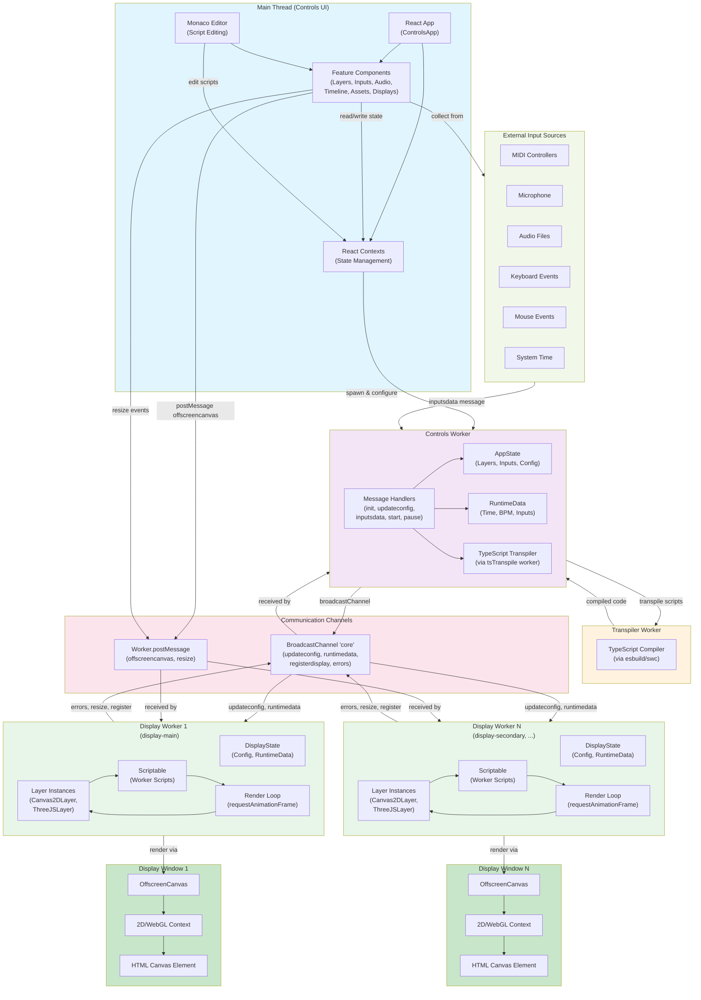
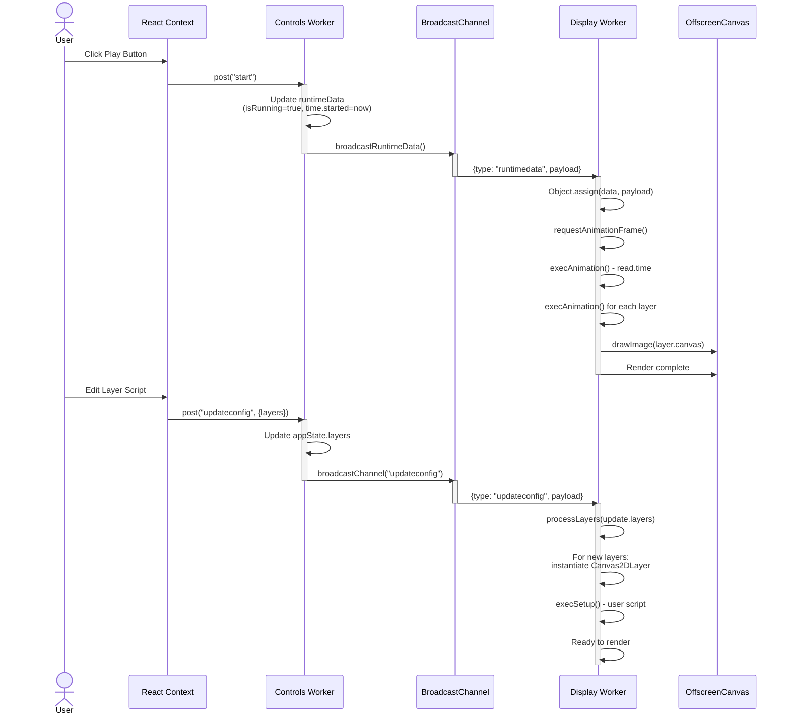
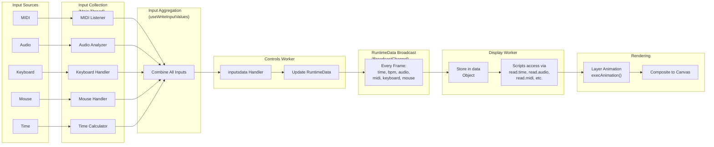
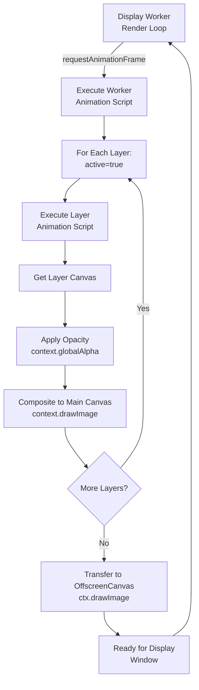
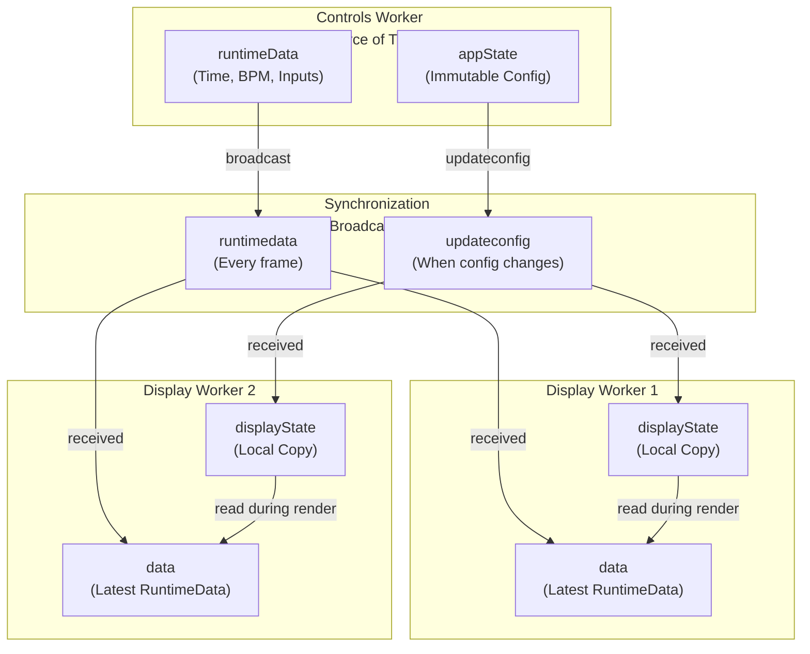
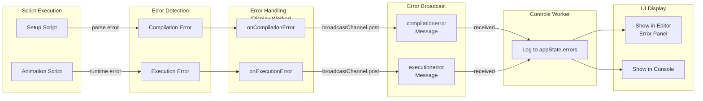

# Visual Fiha Architecture Diagram

## System Overview

## Detailed Message Flow

## Data Flow Diagram

## Layer Rendering Pipeline

## State Synchronization

## Error Handling Flow

## Worker Architecture

```mermaid
graph TB
    subgraph MainContext["Main Thread Context"]
        Window["window object"]
    end
    
    subgraph CW["Controls Worker<br/>(src/controls/Controls.worker.ts)"]
        CWGlobal["self (worker global)"]
        CWListeners["Message Listeners"]
        CWHandlers["Handler Functions"]
    end
    
    subgraph DW1["Display Worker 1<br/>(src/display/Display.worker.ts)"]
        DWGlobal["self (worker global)"]
        DWListeners["BroadcastChannel Listener<br/>+ Worker Message Listener"]
        DWHandlers["Handler Functions"]
    end
    
    subgraph DW2["Display Worker N<br/>(src/display/Display.worker.ts)"]
        DWGlobal2["self (worker global)"]
        DWListeners2["BroadcastChannel Listener<br/>+ Worker Message Listener"]
        DWHandlers2["Handler Functions"]
    end
    
    subgraph TW["Transpiler Worker<br/>(src/utils/tsTranspile.worker.ts)"]
        TWGlobal["self (worker global)"]
        TWListeners["Worker Message Listener"]
        TWHandlers["TypeScript Compiler"]
    end
    
    Window -->|new Worker| CW
    Window -->|new Worker| DW1
    Window -->|new Worker| DW2
    Window -->|new Worker| TW
    
    CWGlobal -->|addEventListener| CWListeners
    CWListeners -->|dispatch| CWHandlers
    
    DWGlobal -->|addEventListener| DWListeners
    DWListeners -->|dispatch| DWHandlers
    
    DWGlobal2 -->|addEventListener| DWListeners2
    DWListeners2 -->|dispatch| DWHandlers2
    
    TWGlobal -->|addEventListener| TWListeners
    TWListeners -->|dispatch| TWHandlers
    
    CWHandlers -.->|async reply| CWListeners
    DWHandlers -.->|async reply| DWListeners
    DWHandlers2 -.->|async reply| DWListeners2
    TWHandlers -.->|async reply| TWListeners
```

---

## Architecture Principles

### 1. **Worker-Based Concurrency**
- Heavy computation (rendering, script execution) runs in workers
- Main thread remains responsive for user interactions
- Each display has its own worker for true parallelism

### 2. **Message-Driven Communication**
- All cross-worker/cross-thread communication via messages
- No shared memory (except transferred OffscreenCanvas)
- BroadcastChannel enables one-to-many communication

### 3. **Separation of Concerns**
- **Main Thread**: UI, user input, state coordination
- **Controls Worker**: State management, configuration, orchestration
- **Display Workers**: Rendering, layer execution, canvas operations
- **Transpiler Worker**: TypeScript compilation

### 4. **Single Source of Truth**
- Controls Worker is the source of truth for AppState
- Each Display Worker maintains its own copy for rendering
- RuntimeData is broadcast to keep all workers in sync

### 5. **Unidirectional Data Flow**
- Configuration flows from Controls → Display workers
- Runtime data flows from Inputs → Controls → Display workers
- Errors and status flow back from Display → Controls

---

## Key Components Reference

| Component | Location | Purpose |
|-----------|----------|---------|
| **Controls Worker** | `src/controls/Controls.worker.ts` | Central state management, orchestration |
| **Display Worker** | `src/display/Display.worker.ts` | Rendering pipeline, layer execution |
| **Transpiler Worker** | `src/utils/tsTranspile.worker.ts` | TypeScript compilation |
| **Communication Utils** | `src/utils/com.ts` | Message creation and handling |
| **Contexts** | `src/controls/contexts/` | React state management |
| **Layers** | `src/layers/{Canvas2D,ThreeJS}/` | Layer implementations |
| **Features** | `src/controls/features/` | UI components for different domains |

