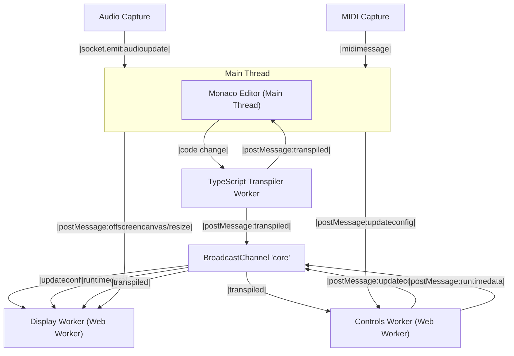

# Visual-Fiha Messaging & Worker Architecture

## Overview
Visual-Fiha uses a modular, message-based architecture to coordinate between the main thread, multiple Web Workers, and windows/contexts. Communication is primarily handled via the [BroadcastChannel API](https://developer.mozilla.org/en-US/docs/Web/API/BroadcastChannel) and structured message utilities in `src/utils/com.ts`.

## Messaging Utilities
- **`src/utils/com.ts`** provides:
  - `makeChannelPost`: Sends typed messages, optionally awaiting responses (async request/response).
  - `makeChannelListener`: Handles incoming messages, dispatching to registered handlers (sync/async).
  - `autoBind`: Binds a channel (e.g., Worker, BroadcastChannel) to the above utilities for easy integration.

All messages include a `meta` object for tracing, error propagation, and operation tracking.

## Message Posting & Processing: Key Locations

### 1. Controls Worker (`src/controls/Controls.worker.ts`)
- **Posts messages:**
  - Uses `broadcastChannel.postMessage` to broadcast updates (e.g., `updateconfig`, `registerdisplaycallback`, `runtimedata`, `transpiled`).
- **Processes messages:**
  - Listens for messages from the main thread via `self.addEventListener('message', ...)`.
  - Listens for cross-context messages via `broadcastChannel.addEventListener('message', ...)`.

### 2. Display Worker (`src/display/Display.worker.ts` & `src/display/VFWorker.ts`)
- **Posts messages:**
  - Uses `BroadcastChannel.postMessage` for cross-context communication.
  - Uses `worker.postMessage` for main thread communication.
- **Processes messages:**
  - Listens for messages from the main thread via `worker.addEventListener('message', ...)`.
  - Listens for cross-context messages via `BroadcastChannel.onmessage`.
  - Message handling is structured via `autoBind` and handler maps.

### 3. TypeScript Transpiler Worker (`src/controls/tsTranspile.worker.ts`)
- **Posts messages:**
  - Uses `self.postMessage` to return transpile results to the main thread.
  - Uses `broadcastChannel.postMessage` to broadcast transpile results to other contexts.
- **Processes messages:**
  - Listens for messages via `self.onmessage`.

### 4. Main Thread Display (`src/display/Display.ts`)
- **Posts messages:**
  - Uses `worker.postMessage` to send canvas and resize events to the display worker.
- **Processes messages:**
  - Listens for messages from the worker via `worker.addEventListener('message', ...)`.

### 5. Audio & MIDI Capture (`src/capture/audio.ts`, `src/capture/midi.ts`)
- **Posts messages:**
  - Audio: Uses `socket.emit` for network, but can be extended to use `ChannelPost` for worker communication.
  - MIDI: Sets up event listeners for MIDI input, can be extended to post messages to workers or channels.
- **Processes messages:**
  - MIDI: Listens for `midimessage` events from MIDI devices.

### 6. Monaco Editor (Main Thread)
- **Posts messages:**
  - On code changes, calls the TypeScript Transpiler Worker ([`src/controls/tsTranspile.worker.ts`](src/controls/tsTranspile.worker.ts)) to transpile user code. ([sending](src/controls/MonacoEditorComponent.tsx))
- **Processes messages:**
  - Receives transpile results from the worker ([receiving](src/controls/MonacoEditorComponent.tsx)) and can forward them to other components or workers as needed.

## Message Flow Example
1. **Config Update:**
   - Main thread sends `updateconfig` to Controls Worker (via `postMessage`).
   - Controls Worker updates config, broadcasts new config via `broadcastChannel.postMessage`.
   - Display Worker receives update via `BroadcastChannel.onmessage`, updates its state.

2. **Runtime Data:**
   - Controls Worker periodically broadcasts `runtimedata` via `broadcastChannel.postMessage`.
   - Display Worker receives and applies runtime data.

3. **Code Transpilation:**
   - User makes changes in Monaco Editor.
   - Monaco Editor sends code change to TypeScript Transpiler Worker.
   - TypeScript Transpiler Worker transpiles code and sends back the result.
   - Monaco Editor receives the transpiled code and can forward it to other components or workers.

## Message Flow Diagram

This diagram shows the main message flows between the main thread, workers, and channels. Solid arrows represent direct `postMessage` or API calls; arrows through `BroadcastChannel` represent cross-context broadcasts.

## Message Types & Payloads
The following table summarizes the key message types, their senders, receivers, and payload structures. This is not an exhaustive list but covers the main communication patterns in Visual-Fiha.

| Message Type         | Sender                | Receiver(s)            | Payload Structure / Notes                                  |
|---------------------|-----------------------|------------------------|------------------------------------------------------------|
| updateconfig        | Main Thread           | Controls Worker        | `{ field: string, value: any }`                            |
| updateconfig        | Controls Worker       | BroadcastChannel       | `AppState` (full config)
| updateconfig        | BroadcastChannel      | Display Worker         | `AppState` (full config)
| runtimedata         | Controls Worker       | BroadcastChannel       | `RuntimeData`                                              |
| runtimedata         | BroadcastChannel      | Display Worker         | `RuntimeData`                                              |
| offscreencanvas     | Main Thread           | Display Worker         | `{ canvas: OffscreenCanvas }`                              |
| resize              | Main Thread           | Display Worker         | `{ width: number, height: number }`                        |
| code change         | Monaco Editor         | TS Transpiler Worker   | `{ code: string, role: string, type: string, id: string }` |
| transpiled          | TS Transpiler Worker  | Monaco Editor          | `TranspilePayload`                                         |
| transpiled          | TS Transpiler Worker  | BroadcastChannel       | `TranspilePayload`                                         |
| transpiled          | BroadcastChannel      | Controls/Display Worker| `TranspilePayload`                                         |
| registerdisplay     | Display Worker        | BroadcastChannel       | `{ id: string, width: number, height: number }`            |
| registerdisplaycallback | BroadcastChannel  | Display Worker         | `{ id: string, config: AppState }`                         |
| audioupdate         | Audio Capture         | Main Thread            | `{ frequency: number[], volume: number[] }`                |
| midimessage         | MIDI Capture          | Main Thread            | `MIDIMessageEvent`                                         |

> For full payload definitions, see the relevant TypeScript types in `src/types.ts`, `src/controls/types.ts`, and `src/utils/com.ts`.
